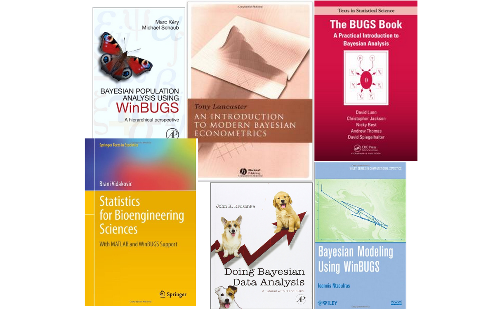

<style>
slides > slide {
  overflow-x: auto !important;
  overflow-y: auto !important;
}
</style>


```{r setup, include=FALSE}
knitr::opts_chunk$set(echo = TRUE,
                      cache = TRUE)
library(nimble)
library(coda)
```

# Workshop organization

We have three hours.

- Four modules, each 35-40 minutes with 5-10 minutes break = 45 minutes total.
- 1. Overview of `nimble`.
- 2. Extending models and methods using `nimbleFunction`s for efficiency and generality.
- 3. `nimbleEcology` distributions for capture-recapture, occupancy, dynamic occupancy, N-mixture, and Hidden Markove models (multi-state / multi-event capture-recapture).
- 4. Case study: Speeding up spatial capture-recapture (`nimbleSCR`).

# What Is NIMBLE?

- A framework for hierarchical statistical models and methods.
- A nearly drop-in alternative to WinBUGS, OpenBUGS and JAGS.
- An extension of the BUGS language for:

    - writing new functions and distributions.
    - named alternative parameterizations (e.g. sd vs precision for `dnorm`).
    - Additional R-like coding, including vectorized declarations.
    
- A configurable system for MCMC.
- A library of other methods.
    
    - Sequential Monte Carlo (particle filtering)
    - Particle MCMC
    - Monte Carlo Expectation Maximization (maximum likelihood)
    - Reversible jump MCMC for variable selection
    - Special components for Conditional Auto-Regressive (CAR) models (spatial) and Bayesian non-parametric distributions (BNP).

- A model-generic programming system to write new analysis methods using two-stage `nimbleFunction`s.
- **N**umerical **I**nference for statistical **M**odels using **B**ayesian and **L**ikelihood **E**stimation.

# Assumptions for this workshop

- You are familiar with the BUGS/JAGS model language.
- You are familiar with ecological statistical models such as

    - capture-recapture
    - occupancy
    - N-mixture (abundance)
    - spatial capture-recapture.

- The emphasis of this workshop is on the `nimble` software itself, and also `nimbleEcology` and `nimbleSCR`.

# The WinBUGS/OpenBUGS/JAGS language has made a huge impact on applied Bayesian statistics.



# First example: CJS capture-recapture model with "classic" dipper data.

Dipper example:

* 294 Dippers monitored 1981-1987.
* One of the most classic capture-recapture teaching datasets ever.
* Thanks to Daniel Turek and Olivier Gimenez for Dipper examples from previous workshops.

Load the data
=====
```{r load_dipper} 
dipper_example_dir <- file.path("..", "..", "content", "examples","dipper")
dipper <- read.csv(file.path(dipper_example_dir,"dipper.csv"))
y <- as.matrix(dipper[ , 1:7])
y <- y + 1 # Code as 1 = not captured, 2 = captured.
first <- apply(y, 1, function(x) min(which(x != 1))) # first capture time
y <- y[ first != 7, ] # remove records with first capture on last occasion
head(y)
```

Conventional Hidden Markov model code, slightly updated.
=====

* data, y: 1 = not-detected, 2 = detected.
* latent states, z: 1 = alive, 2 = dead. (Following convention that "dead" is the last state.)
* Modified from Gimenez et al. capture-recapture workshop

```{r dipper_code_dcat}
dipper_code_dcat <- nimbleCode({
  phi ~ dunif(0, 1) # prior survival
  p ~ dunif(0, 1) # prior detection
  # likelihood
  gamma[1,1:2] <- c(phi, 1-phi)      # Pr(alive t -> alive t+1), Pr(alive t -> dead t+1)
  gamma[2,1:2] <- c(0, 1)            # Pr(dead t -> alive t+1), Pr(dead t -> dead t+1)
  delta[1:2] <- c(1, 0)              # Pr(alive t = 1) = 1, Pr(dead t = 1) = 0
  omega[1,1:2] <- c(1 - p, p)        # Pr(alive t -> non-detected t), Pr(alive t -> detected t)
  omega[2,1:2] <- c(1, 0)            # Pr(dead t -> non-detected t), Pr(dead t -> detected t)
  for (i in 1:N){
    z[i,first[i]] ~ dcat(delta[1:2]) # Illustrates initial state probabilities
    for (j in (first[i]+1):T){
      z[i,j] ~ dcat(gamma[z[i,j-1], 1:2])
      y[i,j] ~ dcat(omega[z[i,j], 1:2])
    }
  }
})
```


# Basic nimble workflow


# Setup data, constants, and inits

```{r setupInputs}
zinits <- matrix(2, nrow = nrow(y), ncol = ncol(y)) # create inits for unknown states
zdata <- matrix(NA, nrow = nrow(y), ncol = ncol(y)) # create data for known states
for(i in 1:nrow(zinits)) {
  known_alive <- range(which(y[i,] == 2))
  zinits[i, known_alive[1] : known_alive[2] ] <- NA # inits -> for known elements
  zdata[i, known_alive[1] : known_alive[2] ] <- 1   # data -> known values
}
dipper_constants <- list(N = nrow(y), 
                         T = ncol(y), 
                         first = first)
dipper_data <- list(y = y,
                    z = zdata)
dipper_inits <- function() list(phi = runif(1,0,1),
                                p = runif(1,0,1),
                                z = zinits)
head(dipper_data$z)     # data and inits have comlpementary
head(dipper_inits()$z)  # NAs 
```

# What are constants? What are data?

### Constants are values needed to define model relationships

- Index starting/ending values like `N`
- Constant indexing vectors for indexing data groupings (site, treatment, individual, time): `beta[ treatment[i] ]`.
- Constants must be provided when creating a model with `nimbleModel`.

### Data represents a flag on the role a node plays in the model

- E.g., data nodes shouldn't be sampled in MCMC.
- Data *values* can be changed.
- Data can be provided when calling `nimbleModel` or later.

### Providing data and constants together.

- Data and constants can be provided together **as `constants`**.
- It would be slightly easier for BUGS/JAGS users to call this "data", but that would blur the concepts.  
- NIMBLE will usually disambiguate data and constants when they are provided together as `constants`.

### What are covariates and other non-parameters/non-observations?

- Covariates/predictors are neither parameters nor data in the sense of the likelihood.
- Covariates/predictors can be provided via `constants` if you don't need to change them (often the case).
- Covariates/predictors can be provided via `data` or `inits` if you want to change them.
    - NIMBLE will not treat them as 'data nodes'.

# Constants vs data for nested indexing

When values are grouped (particularly in irregular ways), we often have (potentially complicated) indexing.

Here is a model code snippet from a GLMM for disease occurrence in deer from different farms. 

- `sex` is coded as 1 or 2 to index fixed-effect intercepts.
- `farm_ids` are coded as 1-24 for random-effect intercepts for data from 24 farms. 
- Membership indices that are known in advance. 
- **Provide known indexing vectors in `constants`.**
- Otherwise `nimble` allows that you (or your model) might change them later, which makes it handle them inefficiently (with unnecessary computation).

```{r, eval=FALSE}
nimbleCode({
  # ...incomplete code snippet...
  for(i in 1:2) sex_int[i] ~ dnorm(0, sd = 1000)  # prior for sex-specific intercepts
  for(i in 1:num_farms) farm_effect[i] ~ dnorm(0, sd = farm_sd) # priors for farm random effects
  farm_sd ~ dunif(0, 100)                         # prior for random effect std. dev.
  for(i in 1:num_animals) {
    logit(disease_probability[i]) <-              # logit link
      sex_int[ sex[i] ] +                         # nested indexing of sex-specific intercepts
      farm_effect[ farm_ids[i] ]                  # nested indexing of farm effects
    y[i] ~ dbern(disease_probability[i])          # "likelihood"
  }
  # ...
})
```
  
# Create a model

```{r nimbleModel, eval = TRUE, echo = TRUE}
dipper_model <- nimbleModel(code = dipper_code_dcat,
                            constants = dipper_constants,
                            data = dipper_data,     # data can be set later.
                            inits = dipper_inits()  # inits can be set later.
                            )                       # dimensions is also a useful argument.
```

# Create an MCMC

```{r configureMCMC, eval=TRUE}
dipper_MCMCconf <- configureMCMC(dipper_model, monitors = c("phi", "p")) # can be skipped if you don't plan to customize
dipper_MCMC <- buildMCMC(dipper_MCMCconf)
```

# Compile the model and MCMC

## 3. Compile the model and MCMC

```{r compileNimble, eval = TRUE, echo = TRUE, message = TRUE}
C_dipper_model <- compileNimble(dipper_model) # These two lines can be done in one line.
C_dipper_MCMC <- compileNimble(dipper_MCMC, project = dipper_model)
```

## 4. Run the MCMC

```{r runMCMC, eval = TRUE, echo = TRUE, message = TRUE}
samples <- runMCMC(C_dipper_MCMC, niter = 10000, samplesAsCodaMCMC = TRUE)
# Alternative:
# C_dipper_MCMC$run(1000)
# samples <- as.matrix(C_dipper_MCMC$mvSamples)
summary(samples)
plot(samples)
```

# How can I use the model in R?

```{r nimbleModel2, eval = TRUE, echo = FALSE}
# Rebuild the model here for safe knitr behavior
dipper_model <- nimbleModel(code = dipper_code_dcat,
                            constants = dipper_constants,
                            data = dipper_data,     # data can be set later.
                            inits = dipper_inits()  # inits can be set later.
                            )                       # dimensions is also a useful argument.
C_dipper_model <- compileNimble(dipper_model) # These two lines can be done in one line.
```

```{r model_demo, eval=TRUE}
class(dipper_model)[1]  # This is a reference class (S5) object
dipper_model$gamma           # Look at a model variable,
dipper_model$y[1:2, ]        # or part of one.
dipper_model$isData('gamma') # Query what is data
dipper_model$getNodeNames()[1:10]  # Query what are the nodes (vertices) in the graph,
dipper_model$getDependencies("z[1, 3]") # and what depends on what..
dipper_model$calculate()     # Calculate the entire model. Return sum of log probabilities.
dipper_model$calculate('z[1, 3]') # Calculate one or more nodes in the model.
dipper_model$calculate(dipper_model$getDependencies('z[1, 3]')) # Calculate based on model structure.
dipper_model$simulate("y", includeData = TRUE) # Simulate new data
head(dipper_model$y)
dipper_model$calculate("y")   # Calculate new sum of log probabilities
C_dipper_model$y <- dipper_model$y # The compiled model can be used in the same way
C_dipper_model$calculate()
```

# NIMBLE might insert nodes into your model!

These are called *lifted nodes*.

### Example 1: reparameterization

You give NIMBLE this:

```{r, eval=FALSE}
nimbleCode({
  tau <- 1E-0.6
  mu ~ dnorm(0, tau)
})
```

* NIMBLE defaults to parameterizations from **WinBUGS/OpenBUGS/JAGS, not R**.  
* Default SD/Var/precision for `dnorm` is **precision** = 1/variance.
* NIMBLE converts this to a *canonical* parameterization for computations by treating it like this:

```{r, eval=FALSE}
nimbleCode({  
  tau <- 1E-0.6
  some_long_name_created_by_nimble <- 1/sqrt(tau) # a lifted node
  mu ~ dnorm(0, sd = some_long_name_created_by_nimble)
})
```

Example 2: Lifted expressions

You give NIMBLE this:

```{r, eval=FALSE}
nimbleCode({
  for(i in 1:n) y[i] ~ dnorm(a + b*x[i], sd = sigma)
})
```

It treats it like this:
```{r, eval=FALSE}
nimbleCode({
  for(i in 1:n) {
    some_long_name_generated_by_nimble[i] <- a + b*x[i] # lifted nodes
    y ~ dnorm(some_long_name_generated_by_nimble[i], sd = sigma)
  })
```

# How can I use the MCMC configuration in R?

* Change the set of samples that compose an MCMC algorithm.
* See `help(samplers)` for samplers built in to `nimble`.
* Default sampler assignments:

    * Conjugate (Gibbs) sampler when possible.
    * Special samplers for Bernoulli, categorical, Dirichlet, multinomial, possibly others.
    * Slice samplers for discrete distributions such as Poisson.
    * Adaptive random-walk Metropolis-Hastings samplers for other continuous distributions.
    
* MCMC efficiency = Effective sample size (mixing) / computation time

    * Both speed and mixing matter.
    * There is often a tradeoff between these.

* Some ways to customize samplers

    * Block (jointly) sample correlated dimensions.
    * Block (joint) samplers include adaptive random-walk Metropolis-Hastings, automated factor slice sampler, and elliptical slice sampler (special case for MVN).
    * Include multiple samplers that update slowly mixing nodes
    * Sample nodes such as standard deviations on a log scale (control parameter of adaptive random-walk Metropolis-Hastings ("RW") sampler).
    
* Write your own sampler:

    * You don't need to invent new MCMC theory in order to write useful samplers.
    * E.g., sample in way that respects model constraints or otherwise takes advantage of model structure.
    * A good opportunity for new collaborations and new R packages.

```{r, eval=TRUE}
# These steps would be done before buildMCMC
dipper_MCMCconf$printSamplers("phi")
dipper_MCMCconf$removeSamplers("phi")
dipper_MCMCconf$addSampler("phi", type = "slice")
dipper_MCMCconf$printSamplers("phi")
```

# How can I use uncompiled vs. compiled models and algorithms?

* An important and perhaps unfamiliar principle:

    * (Almost) everything can be run **uncompiled** (in R) or **compiled** (in C++).

* Uncompiled use of models and algorithms in R allows debugging.

    * Behavior is not always identical but is close.
    * Example: Error trapping will behave differently.  Errors in C++ might not occur in R.

# Differences from NIMBLE to JAGS and/or BUGS

* See our [guide on converting from JAGS to NIMBLE](https://r-nimble.org/quick-guide-for-converting-from-jags-or-bugs-to-nimble)
* Wrap your model code in `nimbleCode({})` directly in R.
* Provide information about missing or empty indices:

   * Use `x[1:n, 1:m]` or
   * `x[,]` with `dimensions = list(x = c(n,m))`.
   * Do not use `x` without brackets (unless it is a scalar).
* Decide how much control you need:

    * `nimbleMCMC` will do everything.
    * `nimbleModel`, `configureMCMC`, `buildMCMC`, `compileNimble` and `runMCMC` give you more control.
    